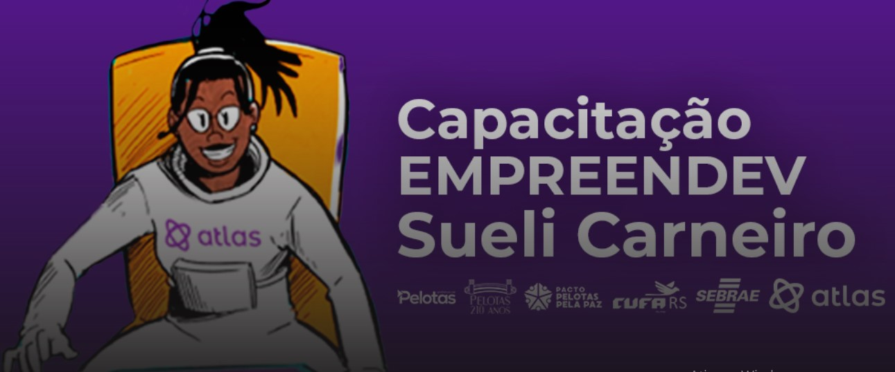

## Be Academy - Atlas(Capacitação Empreendev Sueli Carneiro).

### Descrição:

Módulo: JavaScript Intermediário - Conteúdo estudado: 
Introdução - Variáveis, IIFE e Arrow Functions, For / Loop, Prototypes e Herança ES6 - parte 1, Prototypes e Herança ES6 - parte 2, Orientação a Objetos, Calsses, Herança, Callbacks, Promisses, Promisses - Async / Await, Try / Catch, Rest Spread - Destructuring
e Recrusion.

### 🛠 Conteúdo do Curso:
- JavaScript Intermediário

### Status do Projeto:
50% concluido! Favor aguardar, pois estou trabalhando para concluir. 

### Autor: Professor Marcelo Vasques Vedroni
Projeto desenvolvido por [Marcos Franco](https://www.linkedin.com/in/marcosfranco-5b1a8a111/)

### Contatos:
Linkedin: https://www.linkedin.com/in/marcosfranco-5b1a8a111/

Github: https://github.com/marcos-franco

WhatSapp: https://contate.me/marcos-franco

E-mail: masf68@hotmail.com
